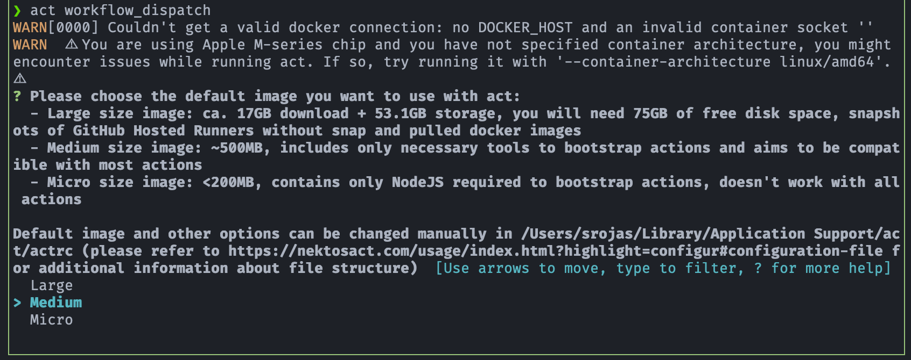
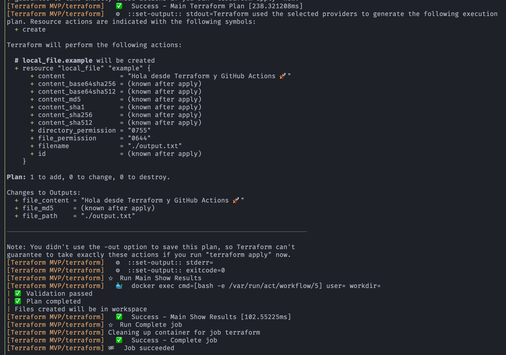

# 🧪 Lab Personal: Despliegue de infraestructura con Terraform y GitHub Actions

[](https://conventionalcommits.org)

## 🎯 Objetivos
La idea es hacer un workflow minimalista, seguro y funcional, que cubra las mejores prácticas: `terraform plan` automático en cada `push` y `terraform apply` manual via `workflow_dispatch`. Empezamos con `backend local`, luego podemos migrar a remoto como mejora.

---

## ⚙ Tecnolgías usadas
- Git Hub Actions
- Terraform
- act
- Docker

---

## ⚙ Este MVP del workflow de GitHub Actions incluye solo lo esencial
- Trigger:
    - `workflow_dispatch`: - Solo ejecución manual
    - No se ejecuta con push, pull request ni nada automático
- Pasos básicos:
    - **Checkout** - Descargar código
    - **Setup Terraform** - Instala Terraform 1.6.0
    - **Init** - Inicializa Terraform
    - **Validate** - Valida la sintaxis
    - **Plan** - Genera el plan de ejecución
    - **Show Results** - Mensaje simple de confirmación

---

## 🛠 Bloques de construcción (building blocks - the basic things that are put together to make something exist)
1. Archivos de Terraform
    - main.tf
    - terraform.tf
    - variables.tf
    - outputs.tf
2. Github Actions workflow de Terraform
    - terraform.yml
3. Docker Desktop para macOs
4. Open Source tool
    - act (ejecución local de workflow)

---

## 🚀 Demostración y Prueba del laboratorio (El MVP Funcional)
1. Iniciar Docker Desktop en macOS:
    ```bash
    open -a Docker
    ```
2. Selección de imagen
- Cuando se ejecuta por primera vez, `act` solicita la selección de la imagen Docker que va a ser usada por default.
- La recomendación es usar al menos la imagen **Medium**
    <p align="center">
        
    </p>
3. Ejecutar el workflow
    ```bash
    act workflow_dispatch -v
    ```
    <p align="center">
        
    </p>

---

## 🔗 Referencias
- [Guia de uso de "act" en Git Hub Actions](https://github.com/samuelrojasm/lab-github-actions-terraform-mvp/blob/main/learning/cheatsheets/guia-github-actions-act.md)
- [Diario de aprendizaje del lab: Github Actions + Terraform + act](https://github.com/samuelrojasm/lab-github-actions-terraform-mvp/tree/main/learning)

---

### 📝 Licencia

Este repositorio está disponible bajo la licencia MIT.
Puedes usar, modificar y compartir libremente el contenido, incluso con fines comerciales.
Consulta el archivo [`LICENSE`](./LICENSE) para más detalles.

---