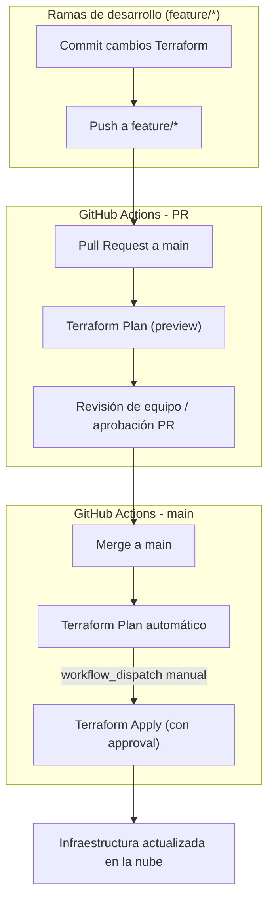

# 🧪 Diario de aprendizaje del lab: Github Actions + Terraform + act

## Índide de Semanas
- [Week 01](#week-01)

---

## 🔥 Week 01 <a name="week-01"></a>

### Índice Week 01
- [Ejecutar workflows localmente con "act"](#local-act)
- [Beneficios de usar act con Terraform](#act-terraform)
- [Archivo terraform.tfstate en act](#act-tfstate)
- [Docker container actions](#docker-container-action)
- [Opciones para evitar ejecuciones no deseadas](#ejecuciones-no-deseadas)
- [Flujo completo con Terraform + GitHub Actions + act, aplicando Trunk-Based Development](#flujo-completo)
- [Diagrama que representa el flujo Trunk-Based Development con Terraform y GitHub Actions](#diagrama-trunk-based)

---

### ⚡ Ejecutar workflows localmente con `act` <a name="local-act"></a>
- El `act` es una herramienta de línea de comandos que te permite ejecutar **GitHub Actions** de forma local, simulando el comportamiento de los **runners de GitHub** sin necesidad de hacer `push` a un repo remoto. 
- Es especialmente útil para probar workflows antes de subirlos, ahorrar tiempo y depurar errores rápidamente.
- Algunos puntos clave:
    - `act` interpreta tu `.github/workflows/*.yml` y ejecuta los jobs localmente.
    - Puede usar **Docker containers** para simular los runners de GitHub.
    - Soporta eventos simulados, como `push`, `pull_request`, `workflow_dispatch`, etc.
    - Permite pasar secrets y variables como si fueran del entorno real de GitHub Actions.

> [!NOTE]
> Internamente, `act` crea contenedores **Docker** que simulan<br>
> los **GitHub runners**, por lo que necesitas tener Docker instalado.

#### 🔗 Referencias workflows localmente con `act`
- [act to run the actions locally](https://github.com/nektos/act)

---

### ⚡ Beneficios de usar act con Terraform <a name="act-terraform"></a>
Permite probar workflows de **GitHub Actions** localmente, ahorrando tiempo, depurando errores antes del push y evitando cambios de infraestructura fallidos en producción.
- **Ahorro de tiempo:** Permite ejecutar workflows localmente sin esperar a los runners en GitHub.
- **Reducción de errores en producción**: Detecta problemas de sintaxis, dependencias o configuración antes de aplicar cambios reales.
- **Iteración rápida**: Cambias el workflow, lo pruebas y corriges errores en minutos.
- **Simulación de entornos reales**: Usa contenedores Docker que replican los runners de GitHub Actions, incluyendo versiones específicas de Terraform, AWS CLI, etc.
- **Debugging avanzado**: Permite correr jobs o pasos específicos para analizar fallos y revisar outputs antes de aplicar.
- **Prueba de secrets y variables locales**: Puedes pasar variables de Terraform o credenciales temporales sin afectar los entornos remotos.

> [!NOTE]
> **Problemas que ayuda a superar**<br>
> - Errores de workflow detectados tarde (solo al hacer push)
> - Cambios de infraestructura que rompen entornos de prueba o producción
> - Largas esperas de ejecución de GitHub Actions para cada cambio menor
> - Dificultad para depurar errores de configuración de Terraform en el CI/CD

> [!TIP]
> - Lo más común es usar `act` para probar hasta el `terraform plan` y reservar el `apply` para el pipeline en GitHub Actions (con approvals).
> - En tu repo: deja `terraform plan` siempre.
> - Haz que `terraform apply` solo ocurra bajo condiciones seguras (manual approval o rama `main`).
> - Localmente con `act`: puedes probar que el workflow funciona (hasta el `plan`).

---

### ⚡ act y terraform.tfstate <a name="act-tfstate"></a>
#### ¿Cómo maneja `act` los contenedores?
- `act` lanza contenedores efímeros de Docker que simulan a los runners de GitHub Actions.
- Cada ejecución de act (`act` o `act -j terraform`) levanta un contenedor nuevo desde cero.
- Al terminar, ese contenedor se destruye → cualquier archivo generado dentro del contenedor se pierde.
#### ¿Qué pasa con el `terraform.tfstate`?
- Si usas **backend local** (por defecto):
    - El `terraform.tfstate` se guarda dentro del contenedor.
    - Como el contenedor se destruye al finalizar, ese state se pierde en cada ejecución de act.
    - Resultado: Terraform siempre cree que es el primer init/plan.
- Si usas **backend remoto** (recomendado):
    - Ejemplo: S3 + DynamoDB en AWS, GCS en GCP, Azure Storage.
    - El state se guarda en la nube, fuera del contenedor.
    - Da igual si corres en GitHub Actions o con `act`: el state es persistente.
- Si quieres mantener state local entre ejecuciones de `act`:
    - Puedes **montar un volumen de Docker** desde tu host al contenedor de `act` para que guarde `terraform.tfstate` fuera del contenedor.
    - Ejemplo:
        ```bash
        # monta tu repo local en el contenedor, por lo que terraform.tfstate se queda en tu máquina.
        act -b --bind
        ```
#### Resumen
- Cada `act` levanta un contenedor nuevo (efímero).
- Con **backend local** → pierdes el `state` con cada ejecución.
- Con **backend remoto** → el `state` se mantiene (mejor práctica en IaC).
- **Alternativa**: montar un volumen local con `act` para que el state quede persistente en tu máquina.

> [!NOTE]
> **Lo típico en un proyecto serio es:**<br>
> - Usar `plan` con `act` para validar que el workflow corre bien.
> - Usar backend remoto para el `state`, y dejar el `apply` solo en GitHub Actions (con approval).

---

### ⚡ Docker container actions <a name="docker-container-action"></a>
- **Qué son:** Son un tipo de acción personalizada que empaquetas dentro de una imagen Docker.
- **Características:** 
    - El código de la acción se ejecuta dentro del contenedor que definas en un Dockerfile.
    - Esto te permite controlar totalmente el entorno de ejecución: dependencias, librerías, sistema base, etc.
    - Son útiles cuando quieres que tu acción sea portátil y reproducible en cualquier runner (hosted o self-hosted).
- Ejemplo de definición de acción:
    ```yaml
    # action.yml
    name: "Mi acción en Docker"
    runs:
        using: "docker"
        image: "Dockerfile"
    ```
- Dockerfile
    ```dockerfile
    FROM node:20-alpine
    COPY entrypoint.sh /entrypoint.sh
    ENTRYPOINT ["/entrypoint.sh"]
    ```
- 
> [!NOTE]
> - **Docker container action**: Es una acción específica dentro del workflow, empaquetada como imagen Docker, que puede correr dentro de un runner (hosted o self-hosted).
> - **Docker container action** es una unidad de trabajo en contenedor que el runner ejecuta.
> - Es solo un step dentro de un job.
> - Ese step en particular corre dentro del contenedor que definiste (por ejemplo con un Dockerfile).
> - No tiene control del workflow completo, solo de lo que sucede en ese paso.

---

### ⚡ Opciones para evitar ejecuciones no deseadas <a name="ejecuciones-no-deseadas"></a>
#### Problema
- Cuando estamos construyendo los workflows de GitHub Actions e IaC en paralelo en una rama de trabajo, y todavía no queremos que se ejecute el workflow de GitHub Actions cada vez que se hacen `merges` a `main`.
- Tenemos un workflow YAML en `.github/workflows/terraform.yml`.
- Cada vez que se hace `merge` a `main`, se dispara automáticamente porque en el `on:` está definido `push: branches: [ main ]`.
- Pero para el caso de fase de documentar / iterar, y no queremos que corra todavía el workflow de GitHub Actions.
#### Opciones para evitar ejecuciones no deseadas
1. Usar solo workflow_dispatch al inicio
- Al principio definir el workflow para que se ejecute solo manualmente:
    ```yaml
    on:
        workflow_dispatch:
    ```
- Así es posible hacer `merge`, documentar y experimentar en `main` sin que corra nada.
- Más adelante, cuando ya esté estable, agregar:
    ```yaml
    on:
        push:
            branches: [ main ]
        pull_request:
            branches: [ main ]
        workflow_dispatch:
    ```
2. Condiciones (if:) en los jobs
- Condicionar la ejecución a que exista un archivo o variable específica, por ejemplo:
    ```yaml
    jobs:
        terraform_plan:
            if: github.event_name != 'push'
            runs-on: ubuntu-latest
            steps:
                ...
    ```
- Eso haría que en `push` a `main` no se ejecute nada, pero sí en PR o manual.
3. Workflows en rama separada (`.github/workflows-dev/`)
- Otra práctica es trabajar en workflows fuera de `.github/workflows/` (por ejemplo, en una carpeta `workflows-dev/`) mientras se desarrolla.
- GitHub solo ejecuta lo que esté dentro de `.github/workflows/`.
- Cuando ya estén listos, se mueven a `.github/workflows/`.
4. Feature flag en el YAML
- Poner una condición basada en un secret o variable (ejemplo: `ENABLE_TERRAFORM=true`).
- Así el workflow solo corre si lo habilitamos:
    ```yaml
    jobs:
        terraform_plan:
            if: ${{ vars.ENABLE_TERRAFORM == 'true' }}
    ```
> [!NOTE]
> **Práctica común**
> Empezar con `workflow_dispatch` solamente, hasta que el workflow sea estable.
> Luego añadir `push`/`pull_request` a `main`.

---

### ⚡ Flujo completo recomendado: Terraform + GitHub Actions + act, aplicando Trunk-Based Development<a name="flujo-completo"></a>
1. Desarrollo en ramas cortas (feature branches)
    - Se crean ramas pequeñas (`feature/ajuste-bucket`, `fix/variable-region`, etc.).
    - En esta rama se hacen los cambios de Terraform.
2. Pull Request hacia `main`
    - Antes de hacer `merge`, se abre un PR a `main`.
    - En el PR se ejecuta el workflow de Terraform Plan para mostrar qué cambios se harían.
    - El equipo revisa el `plan` (es como un preview de la infraestructura).
3. Merge a`main`
    - Una vez aprobado, se hace merge a `main`.
    - El workflow de `main` ejecuta el `plan` automáticamente.
    - El `apply` no corre automáticamente → se deja bajo control de `workflow_dispatch` (approval manual).
4. Deploy controlado (`terraform apply`)
    - Cuando se decide aplicar los cambios, alguien dispara manualmente el workflow (`workflow_dispatch`).
    - Ahí sí se hace `terraform apply` con el `tfplan` validado previamente.
#### Beneficio de este enfoque
- **Ramas cortas** → menos conflictos y cambios más fáciles de revisar.
- **Plan en PR** → transparencia, todos ven qué infraestructura se va a cambiar antes de aplicarla.
- **Merge seguro a main** → no aplica automáticamente, solo genera plan.
- **Apply manual** → control, approvals y reducción de riesgos en producción.
#### ¿Y act dónde entra?
- Usar antes del PR para probar el workflow en tu máquina:
    - `act -j terraform_plan` → validas que el plan funciona.
    - Ahorro de `push` innecesarios y errores en el pipeline real.
- Luego subir la rama con confianza de que en GitHub Actions se verá igual.
> [!NOTE]
> **Resumen: En un flujo Trunk-Based Development con Terraform:**<br>
> - Se trabaja en ramas cortas,
> - `plan` corre en PR y en `main`,
> - `apply` queda bajo approval manual con `workflow_dispatch`.

---

### ⚡ Diagrama que representa el flujo Trunk-Based Development con Terraform y GitHub Actions<a name="diagrama-trunk-based"></a>


- En este flujo se ve:
    - El dev trabaja en ramas cortas.
    - Al abrir un PR contra `main`, se genera un `terraform plan` para que el equipo revise.
    - Cuando el PR se aprueba y se hace merge a `main`, se corre otro `plan`.
    - El `apply` solo ocurre si alguien lo lanza manualmente vía `workflow_dispatch`.

---

#### 🔗 Referencias
- [file Function](https://developer.hashicorp.com/terraform/language/functions/file)

---